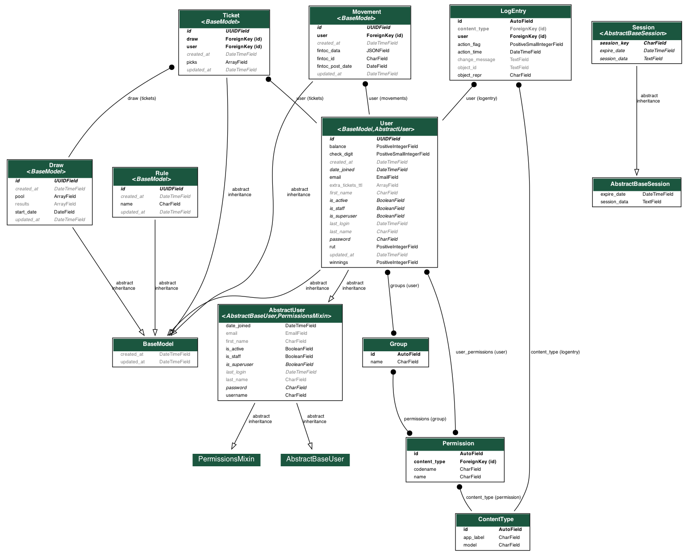

<h1 align="center">Con Yappa</h1>

<p align="center">
  <em>Latam’s first prize-linked savings account.</em>
</p>

<p align="center">
  <a href="https://api.conyappa.cl/docs" target="_blank">
      
  </a>

  <a href="https://api-staging.conyappa.cl/docs" target="_blank">
      
  </a>
</p>



## Requirements

- [Docker](https://www.docker.com/) (needed)
- [Docker Compose](https://docs.docker.com/compose/) (needed)
- [Make](https://en.wikipedia.org/wiki/Make_(software)) (highly recommended)
- [Poetry](https://python-poetry.org/docs/) (highly recommended)

## Install Con Yappa’s back end for local development

Create your local settings (_i.e._, environment variables):

```bash
make localsettings
```

---

Build the Docker images:

```bash
docker-compose build --parallel
```

---

If you want, you can drop the database (_i.e._, erase everything, including migrations):

```bash
docker-compose down --volumes
```

---

If you want, you can run the migrations manually (the next step will do it for you, though):

(The database might not be ready yet; if the command fails then try again.)

```bash
make migrate
```

---

Start the application:

```bash
docker-compose up
```

(Then, to stop the application just type `ctrl-C`.)

---

Kill all processes (on another terminal, if the application is still running):

```bash
docker-compose down
```

## Wanna write some code? Follow these steps first

Create a development-friendly virtual environment:

```bash
make createvenv
```

---

If new dependencies are added, update your virtual environment and re-build the Docker images:

```bash
make createvenv
docker-compose build --parallel
```

---

If you are adding any files or folders that should be considered by Docker, unignore them at the `.dockerignore`. Then, re-build the images:

```bash
docker-compose build --parallel
```

---

Format your code with [Black](https://pypi.org/project/black/) and [iSort](https://pypi.org/project/isort/):

```bash
make format
```
